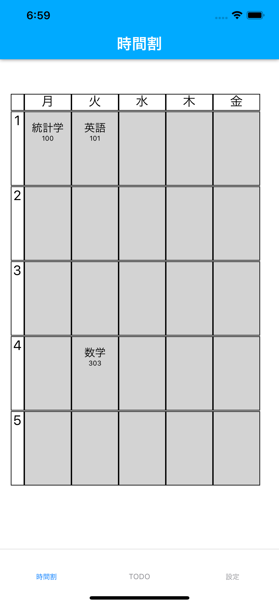
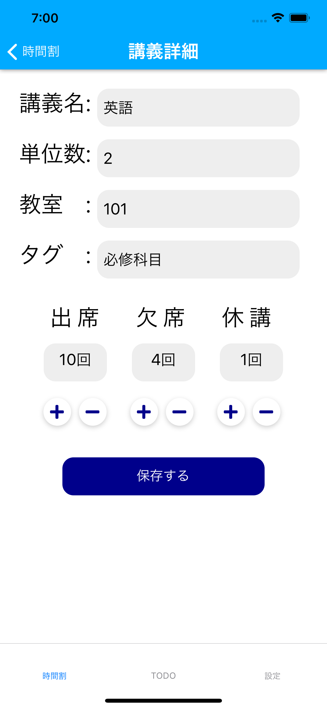

# 時間割モバイルアプリ(timetable_mobile_app)

 最低限の機能を実装したので、とりあえず書く。
 大学生の講義の時間割を管理するモバイルアプリケーション。react-nativeで実装しているが、iOSアプリを想定して作成。
 firebaseを使用しているため、異なるデバイスでも同じ時間割が表示される。将来的には、swiftでiOSアプリとして実装する予定。
 
## 実装する予定の機能

* TODOリスト(済)
* 卒業までに必要な単位数の計算
* 複数の時間割を設定
 
## 開発環境

* expo 3.4.1
* firebase
* react native
 
## 画像

